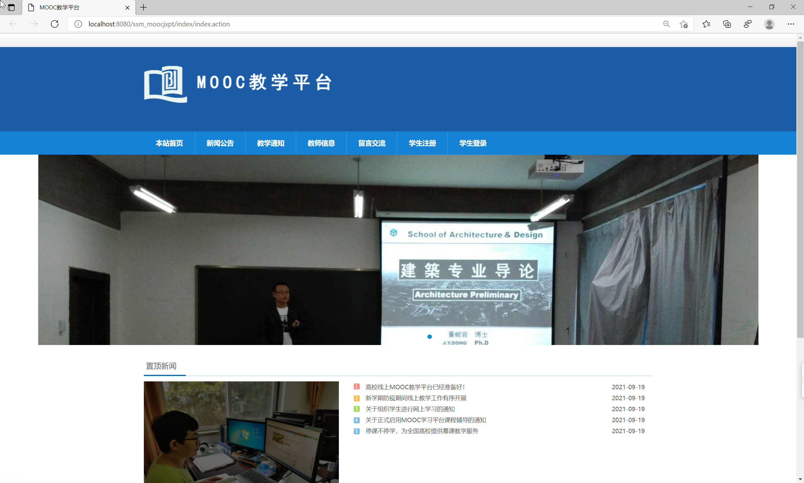
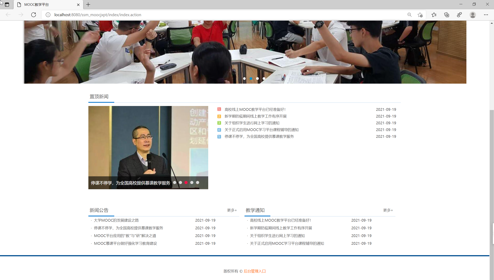
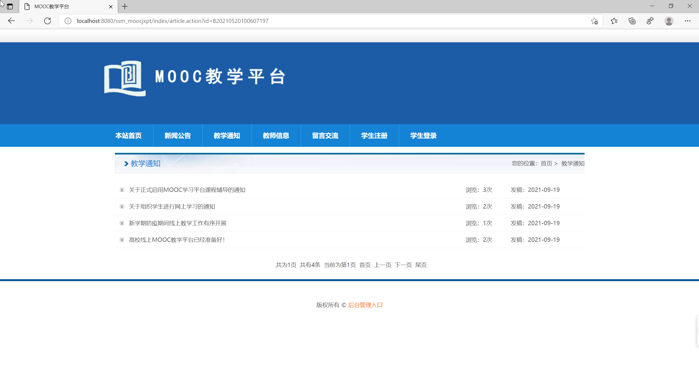
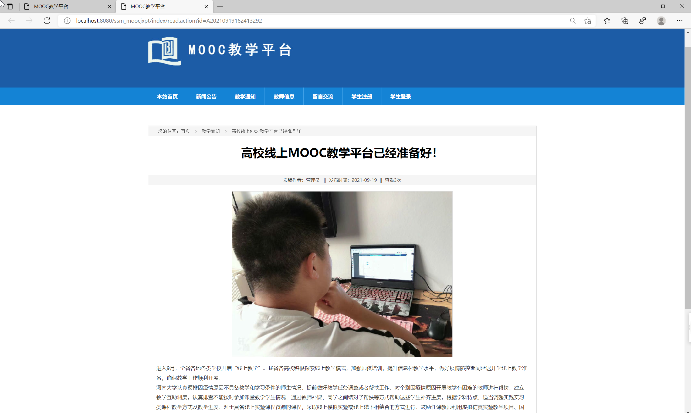
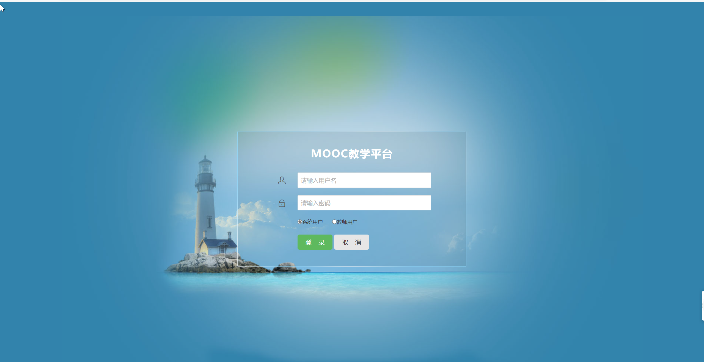
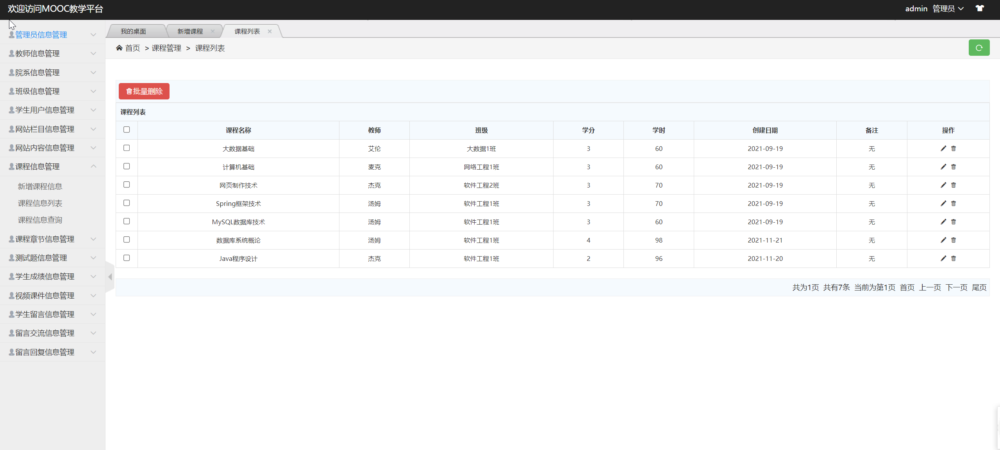
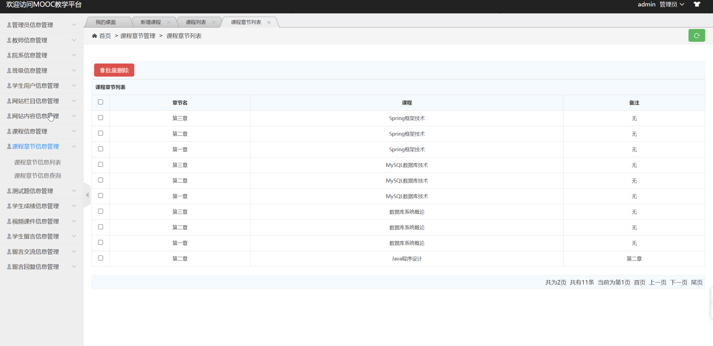
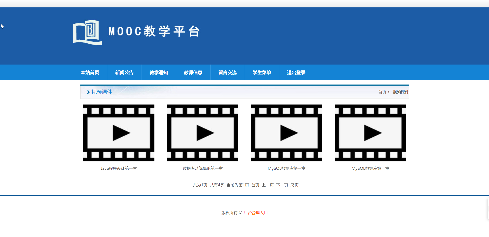
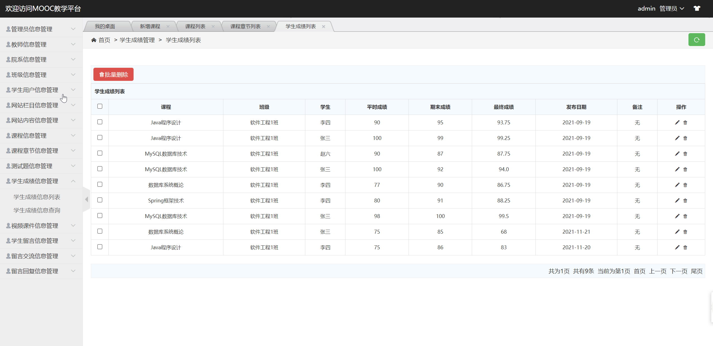

## 基于SSM框架的MOOC教学平台

###  获取sql数据库文件: 从戎源码网 (https://armycodes.com/) QQ: 386869957 QQ群: 377586148
###  所有系统地址: (https://github.com/YuLin-Coder/AllProjectCatalog) 
###  所有项目以及源代码本人均调试运行无问题 可支持远程安装部署调试、定制修改、代码讲解

## 项目介绍
基于SSM框架的MOOC教学平台，该系统主要分为前台和后台两大功能模块，共包含三种角色，分别是：学生、教师、系统管理员。

其功能如下：
1.前台功能
前台首页、新闻公告、教学通知、教师信息、留言交流、学生注册、学生登陆、个人中心、我的课程、我的成绩、在线测试、我的错题集、教学视频等功能。
2.后台功能
后台系统登陆、学生信息管理、教师信息管理、管理员信息管理、院系信息管理、班级信息管理、课程信息管理、课程章节管理、网站公告管理、测试题管理、学生成绩管理、视频课件管理、学生留言管理、留言交流管理等功能。

## 项目技术
- 编程语言：Java
- 数据库：MySQL
- 前端技术：JSP、jQuery 、H-ui
- 后端技术：Spring、SpringMVC、MyBatis

## 运行环境
- JDK版本：JDK1.8及以上
- 开发工具：IDEA、Ecplise、Myecplise都可以
- 数据库: MySQL5.7及以上
- Maven：maven3.0及以上

## 运行截图

